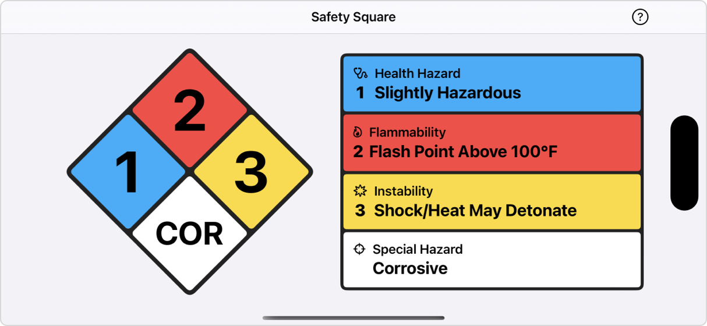

<h1>

Safety Square
</h1>

Quickly interpret NFPA 704 signs, also known as safety squares, fire diamonds, or hazard diamonds.

Tap areas on the diamond to change hazards. See additional information by tapping the hazard description.

